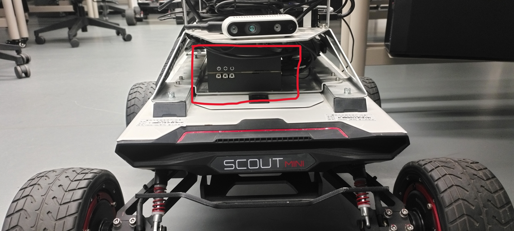
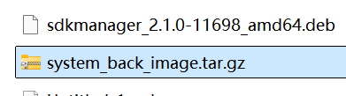
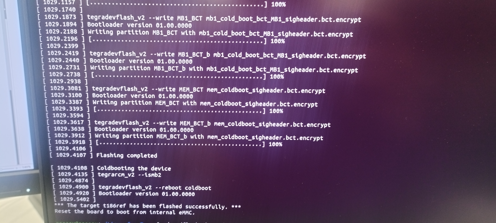

# Coworker

车载软件开发基础

开发者：王鹏 李萌

时间：2024/9/18

## 一. 系统刷机

使用重庆大学提供的定制系统镜像文件，对nvidia xavier进行刷机.

**NVIDIA Xavier**:
这是由nvidia推出的一款高性能Soc，能够支持完成小车的数据计算功能和机体控制功能，是小车的核心控制组件。
它在如图所示位置：

我们需要对它执行刷机操作。

**定制系统**：使用重大提供的定制系统，帮助我们对xavier刷机，它能自动安装ubuntu18、ros环境及各种硬件设备驱动。



**准备工具**:

1. 下载好的定制系统
2. 装有ubuntu的电脑主机（目测任意版本系统都行，但要能支持安装sdkmanager）
3. 高性能Usb-c数据线（普通的不行）
4. 松林小车（主要对其上的Xavier进行刷机）
5. sdkmanager(定制系统所在的压缩包中有.deb安装包)

**主要步骤**

1. 安装sdkmanager
2. 连接Xavier 与 ubuntu主机
3. 将Xavier设置成刷机模式
4. 启动定制系统中的刷机程序，等待刷机完成 


## 开始安装

1. 下载镜像，得到压缩包，解压压缩包并进入，得到镜像及各种shell文件所在的文件(定制系统)、说明文档以及nvikdia jetson的.deb文件

2. 安装sdkmanager： 当前目录下打开终端，执行：

   ```
   sudo apt update
   sudo apt install ./sdkmanager_1.7.3-9053_amd64.deb
   ```

3. 将松林小车设置成刷机模式（recovery mode）

   方法如下（二者任选其一）：
   (1)启动后久按中间按钮(focre reset), 然后继续按左边按钮(power)，同时松开即可进入刷机模式			

   (2)启动后，按右键，xariver关机，然后久按中键和右键，开机后同时松开，即可进入刷机模式。


4.  验证小车是否进入刷机模式： 用usb-c线将小车xariver和电脑主机连接，在ubuntu 终端中执行``` lsusb```, 如果发现有**nvidia corp.**设备，即代表安装成功.


5. 进入镜像文件Linux_for_Tegra目录下.

   ```cd ~/JetPack_4.4.1_Linux_JETSON_AGX_XAVIER/Linux_for_Tegra```

6. 运行烧录程序，当结束后进入设备即可正常使用

   ``` sudo ./flash.sh -r jetson-xavier mmcblk0p1```

**开始烧录**

**完成烧录**



## 常见错误

执行烧录程序后，出现以下报错信息：
```
###############################################################################
# L4T BSP Information:
# R32 , REVISION: 5.2
###############################################################################
Error: probing the target board failed.
       Make sure the target board is connected through 
       USB port and is in recovery mode.
```
原因是因为所用的usb-c数据线性能不行，需要换更高质量的